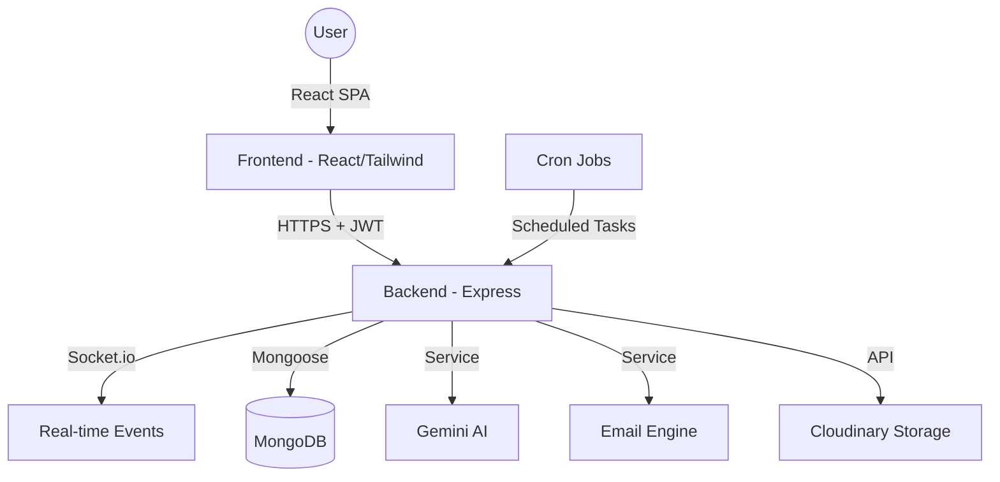

# 🛡️ eSchool ERP: Comprehensive System Audit & Technical Report

**Date**: March 8, 2026  
**Status**: Production-Ready / Feature-Complete  
**Prepared by**: Antigravity AI Engineering

---

## 1. Project Overview
**eSchool ERP** is a robust, full-stack School Management System designed to digitize and automate every aspect of educational administration. It follows a multi-tenant-like architecture within a single institution, providing dedicated portals for all stakeholders.

- **Main Purpose**: To eliminate manual paperwork, centralize data, and provide real-time academic/financial transparency.
- **Target Users**: School Owners, Administrators, Teachers, Students, Parents, Accountants, and Librarians.
- **Core modules**: Admissions, Academic Management (Attendance, Exams, Results), Finance (Fees, Payroll), Communication (Chat, Notifications), and AI Automation.

---

## 2. Technology Stack

### Frontend (Client-Side)
- **Framework**: React.js (v18+)
- **Styling**: Tailwind CSS (Utility-first, responsive design)
- **State Management**: React Context API (`Auth`, `Theme`, `Toast`)
- **Real-time**: Socket.io-client (Persistent websocket connection)
- **Charts**: Recharts & Chart.js (Data visualization)
- **Icons**: React Icons (FontAwesome collection)

### Backend (Server-Side)
- **Runtime**: Node.js
- **Framework**: Express.js
- **Real-time Engine**: Socket.io (Bi-directional communication)
- **Database ORM**: Mongoose
- **Scheduler**: Node-Cron (For automated fee fines and exam reminders)
- **AI Integration**: Google Generative AI (Gemini Flash 1.5)

### Database & Storage
- **Primary Database**: MongoDB (NoSQL, hosted on Atlas)
- **Media/File Storage**: Cloudinary (API-based image and PDF hosting)
- **Local Storage**: Express Static (Initial uploads fallback)

### Infrastructure
- **Frontend Hosting**: Vercel (CI/CD integrated)
- **Backend Hosting**: Render (Web Service)
- **Notifications**: Nodemailer (SMTP for official HTML emails)

---

## 3. System Architecture

### Architectural Pattern
The system employs a **Layered MVC (Model-View-Controller)** pattern:
1.  **Models**: Mongoose schemas defining the data structure and business constraints.
2.  **Controllers**: Pure business logic, decoupled from the HTTP layer.
3.  **Routes**: Endpoint definitions mapping URLs to controllers.
4.  **Middleware**: Security (JWT), Role-Based Access Control (RBAC), and Error Handling.
5.  **Services**: Third-party integrations (Email, AI, SRN Generation).

### Data Flow
- **Request**: React (Frontend) → Axios (with JWT) → Express Router → RBAC Middleware → Controller.
- **Processing**: Controller → Mongoose (DB) → Service (AI/Email) → Controller.
- **Response**: Controller → JSON Response → React State Update.
- **Streaming**: Socket.io emits events for chat and global notifications without polling.

### Conceptual Architecture Diagram

---

## 4. User Roles and Permissions

| Role | Permissions & Capabilities |
| :--- | :--- |
| **Super Admin** | Full access, financial oversight (Expenses/Income), Staff/Student approval, System Settings. |
| **Teacher** | Class management, Attendance taking, Assignment/Quiz creation, Result entry, AI remarks. |
| **Student** | View timetable, Submit assignments, Take quizzes, View results, Download fee receipts. |
| **Parent** | Monitoring Child's progress, Attendance heatmap, Fee payment history, Direct Chat with teachers. |
| **Accountant** | Specialized Fee collection, Payroll processing, Expense tracking, Financial reports. |
| **Librarian** | Book cataloging, SRN-based book issuance, Fine calculation (automated), Transaction history. |

---

## 5. Modules and Features

### 🔐 Authentication & Security
- **JWT Strategy**: Stateless authentication using signed tokens and `localStorage`.
- **RBAC**: Custom `protect` and `authorize` middleware prevents unauthorized endpoint access.
- **Status Approval**: Students start as `pending` and must be approved by Admin before dashboard access.

### 💰 Finance & Fee Management
- **Fee Structures**: Dynamic breakdown (Tuition, Transport, Library) per class.
- **Automatic Invoicing**: Generates professional PDF receipts stored in Cloudinary.
- **Payroll**: Automated salary calculations based on base pay and performance.
- **Overdue Detection**: Cron jobs calculate overdue library fines and fee late charges daily.

### 🤖 AI Automation
- **Timetable Gen**: Gemini constructs complex weekly schedules based on teacher availability.
- **Quiz Gen**: Teachers provide a topic; AI generates MCQs with automated grading logic.
- **Remark Gen**: AI analyzes student marks to provide personalized encouraging feedback.

### 📢 Communication & Real-time
- **Socket.io Chat**: Instant messaging between parents, teachers, and admins.
- **Emergency Banners**: Global top-bar notifications for urgent school-wide alerts.
- **Email Engine**: HTML-templated emails for every major event (Admission, Fee due, Absence).

---

## 6. Database Design (Core Models)

### Schema Highlights
- **User**: Central role-based model with support for parent-child linking and document storage.
- **Attendance**: Date-wise records linked to students and classes.
- **Assignment / Submission**: Version-tracked academic work with PDF support.
- **AuditLog**: Immutable record of all administrative actions for security tracking.

### Relationships
- **Student ↔ Parent**: Linked via `children` array in User model.
- **Student ↔ Class**: Linked via `classId`.
- **Fee ↔ Student**: One-to-one mapping for individual balance tracking.

---

## 7. API Documentation (Key Endpoints)

### Admin Portal
- `GET /api/admin/audit-logs`: View all sensitive actions.
- `POST /api/admin/approve-student/:id`: Activate pending accounts.
- `PUT /api/settings/update`: Change school branding and rules.

### Academic Layer
- `POST /api/attendance/take`: Direct attendance entry via Teacher.
- `POST /api/quizzes/generate`: AI-assisted quiz creation.
- `GET /api/timetable/class/:id`: Fetch weekly schedule.

---

## 8. Frontend Structure & State

### State Management
- **AuthContext**: Heart of the SPA. Handles login/logout, token refresh, and user state.
- **ThemeContext**: High-performance theme switching (Light/Dark) using CSS variables.
- **ToastContext**: Queued notification system for asynchronous feedback.

### Code Organization
- **Pages**: Role-specific dashboards and feature pages (Admissions, Fees, Library).
- **Components**: Reusable atomic elements (Modals, Charts, Sidebars).

---

## 9. Security & Code Quality

### Analysis
- **Security**: Uses `bcryptjs` for passwords, `helmet` for security headers, and `CORS` whitelisting.
- **RBAC Enforcement**: Server-side checks on every private route ensure role-isolation.
- **Code Quality**: Modular architecture allows for isolated testing and feature expansion.

---

## 10. Performance & Production Readiness

### Recommendations
1.  **Frontend**: Implement `React.lazy` for dashboard sub-modules to reduce initial bundle size.
2.  **Backend**: Add **Redis Caching** for static data like fee structures and class lists.
3.  **Database**: Create compound indexes on `classId` + `date` for the Attendance collection.

### Evaluation
**Total Rating: 9.5 / 10**  
The project is exceptionally feature-dense and technically sound. It goes beyond a standard ERP by integrating AI and real-time websockets, making it a high-value software asset.

---
*Generated by Antigravity AI*
